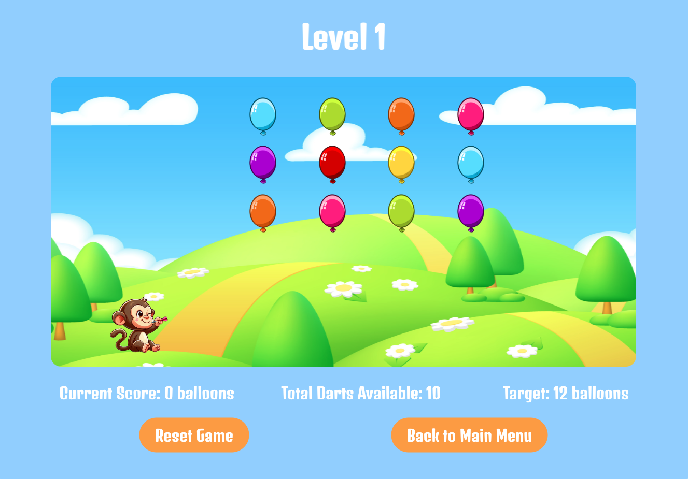

# Bloons Game

---

### **_Description_**

#### In this game, players control a playful monkey equipped with dart-launching weapons, tasked with the mission of popping as many vibrant balloons, known as "bloons," as they can.

---

### **_Instructions to play_**

- Use the mouse to hover over the monkey and accurately aim the darts.
- Click to release the dart.
- Your objective is to pop as many balloons as possible using your limited supply 
 of darts and reach the target to advance to the next level.
- Keep in mind that you have a specific number of darts for each level, and any 
 unused darts will not carry over to the next level.

---

### **_Build with_**

- Javascript
- HTML
- CSS

---

### **_Screenshots_**

##### Main Menu

##### Level 1 preview

---

### **_Project Updates_**

- Add more levels
- Improve animations
- Add special balloons

---

### **_Links_**

#### [Github](https://github.com/emmyileeva) | [Wireframe](https://wireframe.cc/pfOEVh)

---

### **_Acknowledgments_**

dart and monkey design
https://designer.microsoft.com/home?skiptoguestmode=true

game background
https://www.vecteezy.com/vector-art/20570946-meadow-panorama-3d-illustration-bright-landscape-of-green-valley-kids-background-colorful-cute-scene-with-spring-green-grass-trees-chamomile-flowers-blue-sky-sun-clouds-for-children-s-game

https://www.silvergames.com/en/bowman#google_vignette

balloon images
https://www.gamedevmarket.net

https://www.rapidtables.com/web/color/RGB_Color.html

https://fonts.google.com/selection/embed

https://stackoverflow.com/questions/7880053/proper-way-to-position-before-pseudo-elements